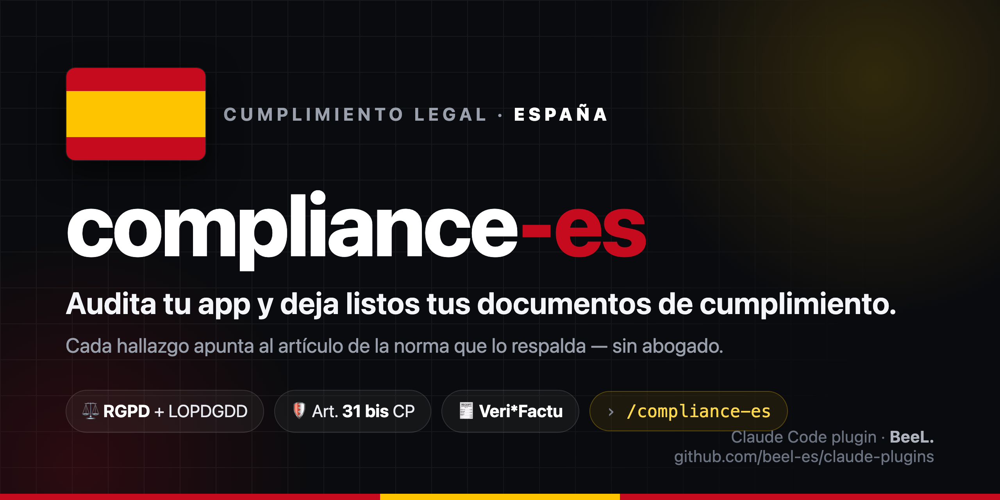

<div align="center">



# compliance-es

### Cumplimiento legal para tu SaaS español, desde la terminal

Un plugin de [Claude Code](https://claude.ai/code) que lee tu código, arma los documentos de cumplimiento y
te deja listo para cumplir **sin abogado**. Cada conclusión apunta al artículo de la norma que la respalda;
el abogado queda como un plus opcional, no como requisito para partir.


[](../../LICENSE)

</div>

---

## Por qué

El RGPD y la LOPDGDD ya rigen, con multas de hasta **20 M€ o el 4 %** de la facturación. La responsabilidad
penal de la empresa (**art. 31 bis CP**) aplica a toda persona jurídica, incluida una SL de un socio, y el
**canal de denuncias** (Ley 2/2023) es obligatorio desde 50 trabajadores. Y la facturación antifraude
(**Veri*Factu**) llega para Sociedades el **1-ene-2027** y para autónomos el **1-jul-2027**. Casi nadie llega
preparado.

`compliance-es` hace el trabajo completo en una corrida: el inventario, los documentos y el diagnóstico
técnico. La idea es que un founder o autónomo arme su cumplimiento solo, sin un despacho cobrándole varios
miles por el trabajo mecánico.

## Qué hace

Corres `/compliance-es` sobre tu repo y:

1. Te pregunta lo básico: empresa, si eres responsable o encargado de los datos, nº de trabajadores, si
   emites facturas, y qué normas auditar.
2. Lee el código y mapea qué datos personales guardas y a qué proveedores se van (transferencias fuera del EEE).
3. Evalúa los controles con un catálogo que puntúa varias normas a la vez.
4. Arma los documentos: RAT, política de privacidad, DPA, plan de brechas, modelo de compliance penal, código
   ético, matriz de riesgos penales, política del canal de denuncias y checklist Veri*Factu.
5. Guarda el estado en `.compliance/` y lo versiona, así ves qué mejora o qué se rompe entre corridas.
6. Te explica cada decisión con su artículo y trae guías para cuando pase algo: un derecho del interesado,
   una brecha, una inspección de la AEPD o de Hacienda.
7. **Construye las remediaciones**: como corre en Claude Code, implementa los arreglos (MFA, cifrado, audit
   log, endpoints de derechos, consentimiento) y, para facturación, **integra un proveedor Veri*Factu** (la
   API de BeeL.) en vez de reimplementar hash/QR/encadenamiento a mano. Ver `skills/compliance-es/references/build/`.

## Marcos cubiertos

| Pack | Norma | Estado | Cubre |
|------|-------|--------|-------|
| `rgpd-lopdgdd` | RGPD + LOPDGDD | **vigente** | consentimiento, derechos, RAT, DPA, seguridad, brechas (72 h), transferencias, EIPD |
| `compliance-penal` | Art. 31 bis CP + Ley 2/2023 | **vigente** | modelo de organización, código ético, matriz de riesgos penales, canal de denuncias |
| `verifactu` | RD 1007/2023 (Veri*Factu) | **Sociedades 1-ene-2027 · resto 1-jul-2027** | conformidad del SIF, declaración responsable, conservación de registros |

## Instalación

```
/plugin marketplace add beel-es/claude-plugins
/plugin install compliance-es@beel
```

Luego, dentro del repo a auditar:

```
/compliance-es
```

## Ejemplo de output

La skill escribe en el repo auditado un estado vivo y versionable:

```text
.compliance/
├── state.json        # postura por marco + estado de cada control (con evidencia archivo:línea)
├── RESUMEN.md        # brechas priorizadas + qué resolviste + diff vs la corrida anterior
├── INSTRUCTIVO.md    # guías: derechos · brecha · inspección AEPD · Hacienda · calendario
└── docs/
    ├── rgpd-rat.md  rgpd-politica-privacidad.md  rgpd-dpa.md  rgpd-plan-respuesta-brechas.md  …
    ├── penal-politica-compliance-penal.md  penal-codigo-etico.md  penal-matriz-riesgos-penales.md  …
    └── verifactu-checklist.md  verifactu-declaracion-responsable.md  verifactu-politica-conservacion.md
```

Cada corrida es un commit, así que git te queda como historial: ves cuándo subió o bajó tu postura.

## Respaldado en la norma

El contenido legal se contrasta contra el texto oficial (BOE, EUR-Lex, AEPD, AEAT). En
[`sources/textos/`](skills/compliance-es/sources/textos) se guardan los **extractos literales** de los
artículos citados (grepeables offline), con sus **SHA-256** y URLs en
[`sources/FUENTES.md`](skills/compliance-es/sources/FUENTES.md) y un script de re-descarga
(`descargar-fuentes.py`). En [`references/mapa-articulos.md`](skills/compliance-es/references/mapa-articulos.md)
cada artículo está cotejado contra el texto vigente. Lo que no se puede confirmar queda marcado
`[verificar contra fuente oficial]`.

## Qué no hace

- **Monitoreo / detección de filtraciones en tiempo real** (DLP, alertas 24/7): la skill prepara el plan de
  respuesta y puede configurar alertas sobre el audit log, pero la vigilancia en vivo es otra categoría.
- **Representarte** ante la AEPD, Hacienda o los tribunales (eso es de un abogado), ni emitir la
  **certificación UNE 19601** (un certificador acreditado) ni la **declaración responsable del fabricante**
  del software de facturación (la firma quien produce el software; si usas un proveedor, te la da él).

No reemplaza a un abogado: te deja listo para cumplir y te dice qué falta. Ver
[`references/cuando-acudir-a-abogado.md`](skills/compliance-es/references/cuando-acudir-a-abogado.md).

## Aviso

Esto no es asesoramiento jurídico: un software no asume tu responsabilidad legal, la decisión final es tuya.
Ver [`NOTICE.md`](NOTICE.md).

## Créditos

Inspirado por [`compliance-cl`](https://github.com/Lelemon-studio/compliance-cl) (Lelemon Studio), que aplica
la misma idea —motor de cumplimiento multi-marco en Claude Code— al marco legal chileno. `compliance-es`
adapta el enfoque a la normativa española y de la UE.

## Licencia

[MIT](../../LICENSE) © 2026 Honey Solutions S.L. (BeeL.)
